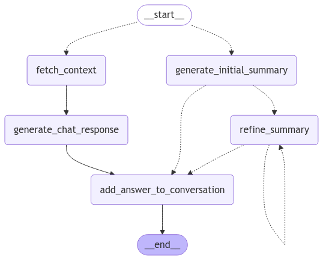

# Document Summarisation Tools

## Introduction

This project uses `pgvector` to store information. The `pgvector` can be installed by running the docker compose

```yaml
docker compose up -d
```

After the pgvector is running, login to postgres container and copy paste the `sql/init.sql` to create `documents` table

This project use `uv` to manage dependency. To install `uv` to your machine, please refer to [uv's installation manual](https://docs.astral.sh/uv/getting-started/installation/).

You can download the project's depndency with this command

```bash
uv sync
```

## How to start the app

The application needs GOOGLE_API_KEY to start

You can start the app by running this Makefile

```bash
# production mode
make run
# development mode
make dev-run
```

## API Documentation

You can found API documentation on [here](http://127.0.0.1:8000/docs).

## Conversation Flow



The conversation uses iterative refinement to create document summarization. The `refine_summary` will continue to run recursively the model reads all document's from user.

## Chat API explanation

Here is the curl command to call conversation API:

```bash
curl --location '<HOST>/v1/conversation' \
--header 'Tenant-Id: internal-audit' \
--form 'project_uuid="14e323af-3895-5435-ade2-f9328e0a890c"' \
--form 'message="<PROMPT>"' \
--form 'conversation_uuid="47f65e64-1ef1-4016-b6ab-dfb0e3231911"' \
--form 'files=<FILE_PATH>' \
--form 'files=<FILE_PATH>' \
--form 'files=files=<FILE_PATH>' \
--form 'is_stream="true"'
```

`Tenant-Id` can be any string

`project_uuid` is project's id. We can create a project with this API:

```bash
curl --location '<HOST>/v1/projects' \
--header 'Content-Type: application/json' \
--data '{
    "name": "<PROJECT_NAME>"
}'
```

`conversation_uuid` is conversation's id. It distinct a particular conversation from others. It is also crucial for LLM's memory management.

`files` supports JPG/PNG and pdf document

`is_stream` is a toggle for response type. If `is_stream` is `true`, backend will response with streamable response. If it `False`, backend will response with a `text/plain` response.
